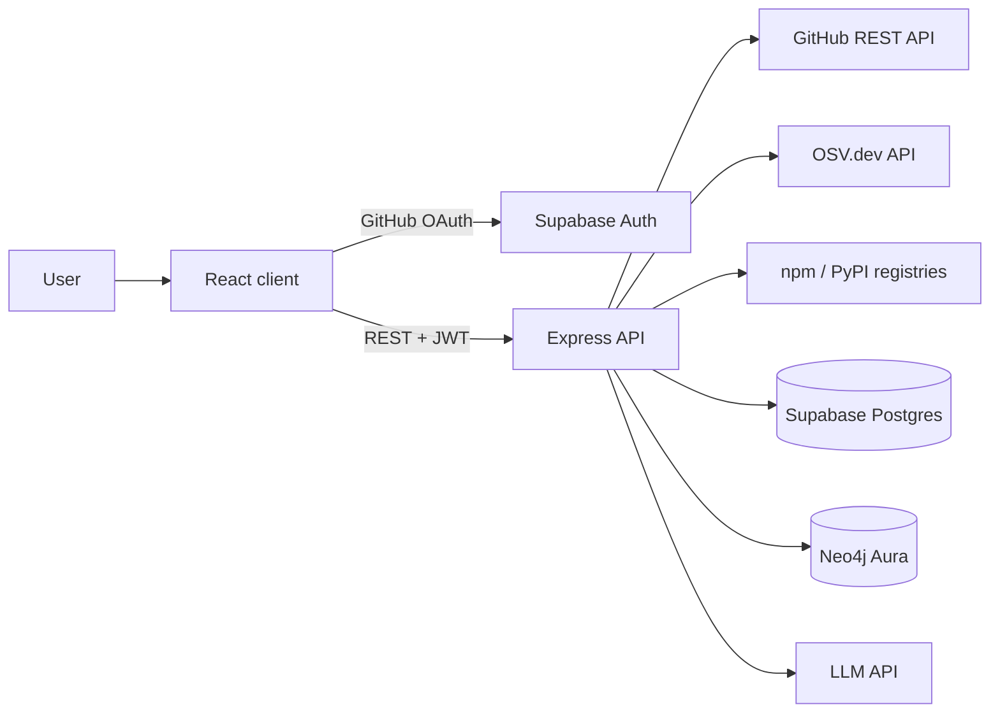

# Technical Requirements Document (TRD) — GitHygiene

Companion to [PRD.md](PRD.md). The build order lives in [../phases/](../phases/).

## 1. Architecture



The client talks only to Supabase Auth (to sign in) and to the Express API. Every other service is called from the server, so no service key or API key ever reaches the browser.

**Scan pipeline:**
Fetch manifests from GitHub → parse into a package list → query OSV for vulnerabilities → query registries for latest versions → compute score → save to Postgres → write graph to Neo4j → notify

## 2. Tech Stack

| Category | Technology | Role |
|---|---|---|
| Frontend | React (Vite), Tailwind CSS, Recharts | Dashboard UI and charts |
| Backend | Node.js, Express | REST API and scan pipeline |
| Auth | Supabase Auth (GitHub OAuth) | Sign-in and sessions |
| Database | Supabase Postgres via `@supabase/supabase-js` | Users, repositories, scans, findings, reports |
| Graph | Neo4j Aura Free via `neo4j-driver` | Cross-repository dependency graph |
| AI | LLM API behind a single wrapper module | Explanations, upgrade plans, summaries |
| External data | GitHub REST API, OSV.dev, npm registry, PyPI JSON API | Repositories, vulnerabilities, package metadata |

### Technical decisions
- **OSV instead of a self-hosted CVE dataset.** OSV is open, needs no API key, matches by exact package and version, and already aggregates GitHub Security Advisories and ecosystem databases. It removes the need to load and maintain vulnerability data ourselves.
- **Lockfile as the source of the dependency tree.** `package-lock.json` already contains every resolved transitive package and version, so the full tree is available without running `npm install` on the server.
- **Neo4j only for what it is good at.** Scan results are stored in Postgres. The graph holds just packages, their edges, and advisories, and answers the multi-hop questions (blast radius, shared dependencies). If the graph is unavailable, scanning and the dashboard still work.
- **One Express service.** The AI code is a module inside the API, not a separate service. One deployable is easier to run, debug, and demo in a day.
- **Server-only data access.** Row Level Security is enabled on every table with no client policies; only the server, using the service role key, reads and writes. Every query filters by the authenticated user's id.
- **Manifests are not stored.** They are fetched, parsed, and discarded; only the extracted package list is saved.

## 3. Repository Layout

```text
.
├── client/          # React app (Vite)
├── server/          # Express API
│   └── src/
│       ├── config/      # supabase, neo4j, env
│       ├── middleware/  # auth, error handling
│       ├── routes/
│       ├── services/    # github, parsers, osv, registry, graph, llm, scoring
│       └── index.js
├── supabase/
│   └── schema.sql
├── docs/
├── phases/
└── .env.example
```

## 4. Authentication

1. The client calls `supabase.auth.signInWithOAuth({ provider: 'github' })`.
2. Supabase returns a session containing an `access_token` (Supabase JWT) and a `provider_token` (GitHub token).
3. The client sends both on API calls: `Authorization: Bearer <access_token>` and `X-GitHub-Token: <provider_token>`.
4. Server middleware validates the JWT with `supabase.auth.getUser(token)` and attaches `req.user`.
5. The GitHub token is used for the request and is never written to the database or logs.

Public repositories need no extra OAuth scope. Importing private repositories requires requesting the `repo` scope at sign-in.

## 5. Data Model

### 5.1 Postgres

| Table | Key columns |
|---|---|
| `profiles` | `id` (= `auth.users.id`), `github_login`, `avatar_url` |
| `repositories` | `id`, `user_id`, `github_id`, `full_name`, `default_branch`, `language`, `last_scanned_at` — unique on (`user_id`, `github_id`) |
| `scans` | `id`, `repository_id`, `status` (`queued` / `running` / `done` / `failed`), `error`, `security_score`, `risk_level`, `started_at`, `finished_at` |
| `dependencies` | `id`, `scan_id`, `ecosystem`, `name`, `version`, `latest_version`, `is_direct`, `is_deprecated` |
| `vulnerabilities` | `id`, `scan_id`, `dependency_id`, `osv_id`, `aliases`, `severity`, `summary`, `fixed_version` |
| `ai_reports` | `id`, `repository_id`, `scan_id`, `type`, `content`, `model`, `created_at` |
| `notifications` | `id`, `user_id`, `type`, `title`, `body`, `is_read`, `created_at` |

Each scan owns its own `dependencies` and `vulnerabilities` rows, so scan history is kept and trends can be charted later. A trigger on `auth.users` creates the matching `profiles` row at first sign-in.

### 5.2 Neo4j

```text
(:Repository {id, fullName})
(:Package {key, ecosystem, name, version})      key = "<ecosystem>:<name>@<version>"
(:Vulnerability {id, severity, summary})

(:Repository)-[:DEPENDS_ON]->(:Package)         direct dependencies
(:Package)-[:DEPENDS_ON]->(:Package)            transitive dependencies
(:Package)-[:AFFECTED_BY]->(:Vulnerability)
```

Package nodes are shared between repositories — that sharing is what makes cross-repository queries possible. Uniqueness constraints on `Repository.id`, `Package.key`, and `Vulnerability.id` keep writes idempotent.

## 6. External APIs

| API | Call | Used for |
|---|---|---|
| GitHub | `GET /user/repos` | Listing repositories to import |
| GitHub | `GET /repos/{owner}/{repo}/contents/{path}` with `Accept: application/vnd.github.raw+json` | Fetching manifests and lockfiles |
| OSV | `POST https://api.osv.dev/v1/querybatch` | Vulnerability IDs for many package versions at once |
| OSV | `GET https://api.osv.dev/v1/vulns/{id}` | Advisory details: summary, severity, fixed versions |
| npm | `GET https://registry.npmjs.org/{name}` | Latest version, deprecation notice |
| PyPI | `GET https://pypi.org/pypi/{name}/json` | Latest version |

OSV and the registries need no API key. Registry lookups are limited to direct dependencies and run with capped concurrency.

## 7. API Surface

All routes are under `/api` and, apart from `/health`, require a valid JWT.

| Method | Route | Purpose |
|---|---|---|
| GET | `/health` | Checks Postgres and Neo4j connectivity |
| GET | `/me` | Current user profile |
| GET | `/github/repos` | Repositories available to import |
| POST | `/repos` | Import selected repositories |
| GET | `/repos` | Imported repositories with latest score |
| DELETE | `/repos/:id` | Remove a repository |
| POST | `/repos/:id/scan` | Start a scan; returns `202` and a scan id |
| GET | `/scans/:id` | Scan status and summary |
| GET | `/scans/:id/dependencies` | Packages found |
| GET | `/scans/:id/vulnerabilities` | Vulnerabilities found |
| GET | `/graph/blast-radius/:vulnId` | Repositories reached by an advisory |
| GET | `/graph/shared` | Packages used by more than one repository |
| GET | `/graph/top-packages` | Most used packages |
| GET | `/graph/repo/:id` | Nodes and edges for the graph view |
| POST | `/ai/explain` | Explain one advisory in this repository's context |
| POST | `/ai/upgrade-plan` | Ordered upgrade plan for a scan |
| POST | `/ai/summary` | Repository health summary |
| GET | `/dashboard/summary` | Totals for the dashboard |
| GET | `/notifications` | List notifications |
| PATCH | `/notifications/:id/read` | Mark as read |

## 8. Scoring

Score starts at 100 and loses points per finding, floored at 0:

| Finding | Penalty |
|---|---|
| Critical vulnerability | 25 |
| High vulnerability | 15 |
| Medium vulnerability | 7 |
| Low / unknown severity vulnerability | 2 |
| Deprecated direct dependency | 5 |
| Direct dependency a major version behind | 1 (capped at 10 total) |

Risk level: `low` ≥ 80, `medium` 50–79, `high` 25–49, `critical` < 25.

The formula is intentionally simple and shown in the UI, so a score can always be explained. The numbers are starting values to tune against real repositories.

## 9. AI Integration

- All LLM calls go through `server/src/services/llm.js`, which exposes one function and reads the provider key and model name from the environment. Swapping providers touches only that file.
- Prompts are built from the scan's stored data: package name, installed version, fixed version, advisory summary, and dependency path. The model is told to use only that data and to say so when it lacks information.
- Results are saved to `ai_reports` with the model name, so a repeated request returns the stored result instead of calling the model again.
- AI output is labelled as AI-generated in the UI.
- The provider and model actually used must be recorded in the README's "Open Source and AI Usage" section.

## 10. Environment Variables

Documented in `.env.example`; real values live only in untracked `.env` files.

```env
# server
PORT=4000
CLIENT_ORIGIN=http://localhost:5173
SUPABASE_URL=
SUPABASE_SERVICE_ROLE_KEY=
NEO4J_URI=
NEO4J_USERNAME=
NEO4J_PASSWORD=
LLM_API_KEY=
LLM_MODEL=

# client
VITE_API_URL=http://localhost:4000/api
VITE_SUPABASE_URL=
VITE_SUPABASE_ANON_KEY=
```

## 11. Security and Reliability

- No secrets in source, docs, or commits. The service role key and LLM key are server-only.
- CORS restricted to `CLIENT_ORIGIN`.
- Every database query is scoped to `req.user.id`; a user can never read another user's repository by guessing an id.
- Input from external sources (manifest contents, API responses) is parsed defensively; a malformed manifest fails that scan with a readable error instead of crashing the server.
- Scans run in the background within the API process. A failed step marks the scan `failed` with the reason. A Neo4j failure is logged and does not fail the scan.
- The platform only reads from GitHub. It never writes to a user's repository.
